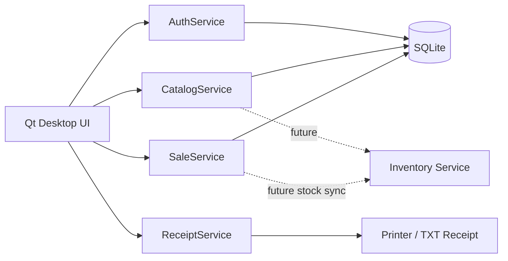

# Koperasi BRIN Point of Sales — Python Desktop

Aplikasi Point of Sales (PoS) desktop untuk kasir toko, dibangun dengan **Python + PySide6 (Qt for Python)** dan **SQLite**. Repository ini sengaja fokus pada proses kasir. Inventory management, stock opname, procurement, dan user management direncanakan sebagai aplikasi/service terpisah.

## Fitur PoS saat ini

- Login kasir berbasis username/password (PBKDF2-SHA256).
- Scan barcode menggunakan barcode scanner USB mode keyboard wedge.
- Input SKU/barcode manual dan pencarian barang berdasarkan nama, SKU, atau barcode.
- Keranjang transaksi: tambah, kurangi, dan hapus item.
- Validasi stok saat memasukkan barang dan saat transaksi difinalisasi.
- Diskon transaksi (%), dukungan pajak terkonfigurasi, dan perhitungan total otomatis.
- Pembayaran: Tunai, QRIS, Kartu Debit/Kredit, dan Transfer.
- Perhitungan uang dibayar dan kembalian.
- Nomor invoice otomatis.
- Struk HTML untuk preview/cetak dan arsip struk TXT otomatis.
- Riwayat transaksi dan reprint struk.
- Shortcut kasir: F2 scan, F3 cari produk, F4 bayar, F6 transaksi baru, F8 riwayat.
- SQLite transactional write (`BEGIN IMMEDIATE`) untuk mencegah overselling lokal pada saat checkout.

## Arsitektur



Struktur kode:

```text
.
├── main.py
├── app/
│   ├── config.py
│   ├── database.py
│   ├── domain.py
│   ├── security.py
│   ├── services.py
│   └── ui/
│       ├── dialogs.py
│       ├── login_window.py
│       ├── pos_window.py
│       └── styles.py
├── tests/
├── receipts/
└── requirements.txt
```

## Menjalankan aplikasi

Direkomendasikan Python 3.11+.

```bash
python -m venv .venv
```

Windows:

```powershell
.venv\Scripts\activate
pip install -r requirements.txt
python main.py
```

Linux/macOS:

```bash
source .venv/bin/activate
pip install -r requirements.txt
python main.py
```

Database `data/pos.db` akan dibuat otomatis saat aplikasi pertama kali dijalankan.

### Akun demo

| Role | Username | Password |
|---|---|---|
| Kasir | `kasir` | `kasir123` |
| Supervisor | `supervisor` | `supervisor123` |

> Akun ini hanya untuk development/demo. Pada implementasi production, login sebaiknya dipindahkan ke Identity/User Management service terpusat.

## Produk demo dan barcode scanner

Aplikasi mengisi beberapa data awal seperti merchandise BRIN, ATK, minuman, dan snack. Scanner barcode USB umumnya bekerja seperti keyboard: arahkan fokus ke field scan, scanner mengetik kode, lalu mengirim Enter. Karena itu tidak diperlukan SDK scanner khusus untuk perangkat keyboard-wedge.

Contoh barcode demo: `8997001000059` (Mug BRIN).

## Konfigurasi environment

Semua opsi bersifat opsional:

```env
POS_STORE_NAME=Toko Koperasi BRIN
POS_STORE_ADDRESS=Badan Riset dan Inovasi Nasional
POS_STORE_PHONE=-
POS_TAX_PERCENT=0
POS_DB_PATH=/path/to/pos.db
POS_RECEIPT_DIR=/path/to/receipts
```

## Menjalankan unit test

```bash
python -m unittest discover -s tests -v
```

## Boundary dengan Inventory & User Management

Saat ini `products` dan `users` berada di SQLite agar PoS bisa langsung didemokan secara standalone. Namun UI tidak mengakses database secara langsung; akses dibungkus oleh `AuthService`, `CatalogService`, dan `SaleService`. Ketika repository Inventory/User Management tersedia, service tersebut dapat diganti menjadi REST/gRPC client tanpa mengubah alur kasir secara besar.

Rencana integrasi berikutnya:

1. `CatalogService` membaca SKU, barcode, nama, harga, dan stock-availability dari Inventory API.
2. Checkout mengirim stock movement/reservation ke Inventory API.
3. `AuthService` memakai User Management/IAM API.
4. Sinkronisasi offline queue ditambahkan untuk cabang yang koneksinya tidak stabil.
5. Printer thermal ESC/POS dapat ditambahkan sebagai adapter selain Qt Printer.

## Catatan production readiness

Versi ini sudah runnable sebagai MVP desktop kasir, namun sebelum produksi disarankan menambahkan device/store identity, shift/open-close cashier, void/refund dengan approval, audit log, cash drawer reconciliation, offline sync, backup database, role/permission terpusat, dan integrasi Inventory API.
