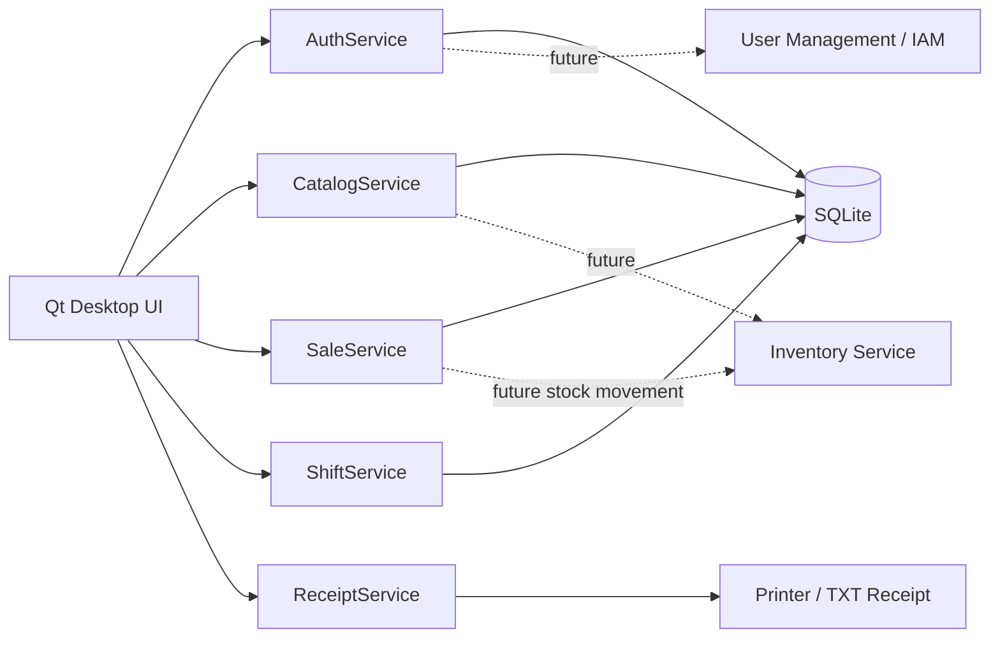

# Koperasi BRIN Point of Sales — Python Desktop

Aplikasi Point of Sales (PoS) desktop untuk kasir toko, dibangun dengan **Python + PySide6 (Qt for Python)** dan **SQLite**. Repository ini fokus pada aktivitas front-counter/kasir. Inventory management, stock opname, procurement, dan administrasi user direncanakan sebagai aplikasi/service terpisah.

## Status

**Operational Cashier MVP — Production Controls Phase 2**

Alur inti yang sudah didukung:

```text
Login -> Buka Shift -> Pilih Anggota (opsional) -> Scan/Cari Barang -> Cart
      -> Diskon Item/Transaksi
      -> Hold/Resume (opsional)
      -> Split/Single Payment
      -> Simpan Transaksi -> Cetak Struk
      -> Riwayat/Reprint/Void
      -> Return/Refund (partial/full, supervisor approval)
      -> Cash In/Cash Out
      -> Tutup Shift & Rekonsiliasi Kas
```

## Fitur PoS

### Login & otorisasi

- Login kasir berbasis username/password.
- Password lokal disimpan dengan PBKDF2-SHA256.
- Role demo `cashier` dan `supervisor`.
- Void transaksi selesai membutuhkan username/password supervisor/admin dan alasan void.

### Shift kasir

- Buka shift dengan input kas awal.
- Satu open shift per kasir.
- Checkout hanya dapat dilakukan jika shift aktif.
- Tutup shift dengan:
  - jumlah transaksi;
  - total penjualan;
  - breakdown metode pembayaran;
  - kas awal;
  - penerimaan tunai;
  - kembalian;
  - expected cash;
  - actual closing cash;
  - cash difference;
  - catatan penutupan.

### Anggota / pelanggan

- Lookup anggota berdasarkan nomor anggota, nama, telepon, atau email.
- Nomor anggota dan nama pelanggan disimpan pada transaksi.
- Identitas anggota tetap tersimpan saat transaksi di-hold dan di-resume.
- Data anggota lokal saat ini hanya adapter development/demo; kontrak service disiapkan agar nanti dapat diganti dengan Membership API Koperasi tanpa mengubah UI kasir.
- Harga/promosi khusus anggota belum diaktifkan otomatis karena aturan pricing sebaiknya berasal dari service bisnis/promo terpisah.

### Cash in / cash out

- Cash-in dan cash-out hanya dapat dilakukan pada shift aktif.
- Setiap pergerakan kas membutuhkan otorisasi supervisor/admin.
- Alasan wajib dicatat.
- Cash-out tidak boleh melebihi expected cash yang tersedia di laci.
- Cash-in/cash-out masuk ke perhitungan expected cash saat closing shift.
- Seluruh aktivitas dicatat pada audit trail.

### Return / refund

- Mendukung partial return maupun full return per item.
- Qty yang sudah diretur tidak dapat diretur ulang.
- Stok barang otomatis dikembalikan saat refund berhasil.
- Refund membutuhkan otorisasi supervisor/admin dan alasan.
- Metode refund: Tunai, QRIS, Transfer, atau Kartu Debit/Kredit.
- Refund tunai hanya dapat dilakukan pada shift aktif.
- Refund tunai tidak boleh membuat expected drawer cash menjadi negatif.
- Nilai refund dihitung dari **nilai final invoice**, sehingga efek diskon item, diskon transaksi, dan pajak ikut diperhitungkan.
- Full return seluruh item dijamin tidak melebihi total invoice.
- Transaksi yang sudah memiliki refund tidak dapat di-void; koreksi berikutnya tetap melalui refund.
- Refund dipisahkan dari transaksi penjualan asli agar histori/audit tetap immutable.

### Audit trail

Critical cashier events disimpan pada tabel `audit_events`, antara lain:

- shift opened / closed;
- sale completed;
- transaction hold / resume / delete;
- sale voided;
- refund completed;
- cash in / cash out.

Audit event menyimpan actor/user, jenis aksi, entity, waktu, dan metadata terkait.

### Scan, pencarian, dan cart

- Scan barcode menggunakan barcode scanner USB keyboard-wedge.
- Input SKU/barcode manual.
- Cari produk berdasarkan nama, SKU, atau barcode.
- Tambah, kurangi, dan hapus item.
- Validasi stok saat item dimasukkan dan saat checkout.
- Diskon per item (%).
- Diskon transaksi (%).
- Pajak terkonfigurasi.
- Perhitungan subtotal, diskon, pajak, dan grand total otomatis.

### Hold / park transaction

- Hold transaksi yang belum selesai.
- Menyimpan:
  - pelanggan;
  - item dan qty;
  - diskon item;
  - diskon transaksi;
  - catatan.
- Daftar transaksi hold per kasir.
- Resume transaksi hold.
- Stok divalidasi ulang saat transaksi hold dilanjutkan.
- Hold **tidak** melakukan reservasi stok.

### Pembayaran

Metode pembayaran:

- Tunai.
- QRIS.
- Kartu Debit/Kredit.
- Transfer.

Mendukung:

- Single tender.
- **Split payment / dua metode pembayaran**.
- Nominal pembayaran.
- Uang pas.
- Perhitungan kekurangan pembayaran.
- Perhitungan kembalian.
- Kelebihan pembayaran hanya diperbolehkan jika terdapat komponen tunai.

### Transaksi dan struk

- Nomor invoice otomatis.
- Header + detail item transaksi.
- Detail metode pembayaran pada tabel `sale_payments`.
- Transactional database write dengan `BEGIN IMMEDIATE`.
- Pengurangan stok dilakukan dalam transaksi database yang sama dengan penjualan.
- Preview struk.
- Print melalui Qt Printer.
- Arsip struk TXT.
- Riwayat transaksi.
- Reprint struk.
- Status transaksi `COMPLETED` / `VOIDED`.

### Void transaksi

Void transaksi selesai:

1. Kasir memilih transaksi dari riwayat.
2. Supervisor/admin memasukkan kredensial.
3. Alasan void wajib diisi.
4. Status transaksi menjadi `VOIDED`.
5. Stok barang dikembalikan secara transactional.
6. Transaksi void tidak dihitung dalam settlement shift.

Untuk menjaga integritas settlement, transaksi yang berasal dari **shift yang sudah ditutup tidak dapat di-void**. Kasus tersebut nantinya ditangani melalui workflow **return/refund**, bukan void.

## Shortcut kasir

| Shortcut | Fungsi |
|---|---|
| `F2` | Fokus scan barcode |
| `F3` | Cari produk |
| `F4` | Bayar |
| `F5` | Hold transaksi |
| `F6` | Transaksi baru |
| `F7` | Daftar / resume hold |
| `F8` | Riwayat transaksi |
| `F9` | Buka / tutup shift |
| `F10` | Cash in / cash out |
| `F11` | Return / refund |

## Arsitektur



Struktur kode:

```text
.
├── .github/
│   └── workflows/
│       └── tests.yml
├── main.py
├── app/
│   ├── config.py
│   ├── database.py
│   ├── domain.py
│   ├── security.py
│   ├── services.py
│   └── ui/
│       ├── dialogs.py
│       ├── login_window.py
│       ├── pos_window.py
│       └── styles.py
├── tests/
│   ├── test_domain.py
│   ├── test_security.py
│   └── test_services.py
├── receipts/
└── requirements.txt
```

## Menjalankan aplikasi

Direkomendasikan Python 3.11+.

```bash
python -m venv .venv
```

Windows:

```powershell
.venv\Scripts\activate
pip install -r requirements.txt
python main.py
```

Linux/macOS:

```bash
source .venv/bin/activate
pip install -r requirements.txt
python main.py
```

Database `data/pos.db` dibuat otomatis saat aplikasi pertama kali dijalankan. Database versi MVP lama akan mendapat lightweight migration ketika aplikasi baru dijalankan.

### Akun demo

| Role | Username | Password |
|---|---|---|
| Kasir | `kasir` | `kasir123` |
| Supervisor | `supervisor` | `supervisor123` |

> Akun demo hanya untuk development. Production login harus diarahkan ke User Management/IAM terpusat.

## Produk demo dan barcode scanner

Aplikasi mengisi beberapa data awal merchandise BRIN, ATK, minuman, dan snack.

Barcode scanner USB pada umumnya bekerja sebagai keyboard-wedge: scanner mengetik barcode ke field aktif kemudian mengirim Enter sehingga tidak memerlukan SDK vendor tertentu.

Contoh barcode demo:

```text
8997001000059 -> Mug BRIN
8997002000010 -> Air Mineral 600ml
```

## Konfigurasi environment

```env
POS_STORE_NAME=Toko Koperasi BRIN
POS_STORE_ADDRESS=Badan Riset dan Inovasi Nasional
POS_STORE_PHONE=-
POS_TAX_PERCENT=0
POS_DB_PATH=/path/to/pos.db
POS_RECEIPT_DIR=/path/to/receipts
```

## Test dan CI

Lokal:

```bash
python -m compileall -q app main.py tests
python -m unittest discover -s tests -v
```

GitHub Actions menjalankan syntax check dan unit/service tests pada setiap push ke `main` dan pull request.

Test mencakup:

- cart, diskon item, diskon transaksi, dan pajak;
- password hashing;
- split payment;
- open/close shift dan cash reconciliation;
- hold transaction;
- supervised void dan stock restoration;
- member/customer attachment;
- partial dan full refund;
- refund allocation terhadap final invoice value;
- refund stock restoration;
- cash refund pada shift;
- cash-in / cash-out reconciliation;
- negative drawer protection;
- audit events untuk operasi kritikal.

## Boundary dengan Inventory & User Management

SQLite masih menyimpan `products` dan `users` agar PoS dapat berjalan standalone untuk development/demo. Namun UI tidak mengakses tabel tersebut langsung.

Integration target:

1. `CatalogService` -> Inventory API untuk SKU, barcode, harga, dan stock availability.
2. Checkout/void/refund -> Inventory API untuk stock movement.
3. `AuthService` -> User Management/IAM API.
4. PoS tetap menjadi front-counter client dan tidak menjadi master inventory/user.

## Fitur berikutnya sebelum production rollout

Fitur berikutnya setelah Production Controls Phase 2:

- integrasi Membership API Koperasi untuk menggantikan data anggota lokal;
- pricing/promotion engine untuk harga anggota, voucher, dan promo;
- ESC/POS thermal printer adapter dan cash-drawer trigger;
- store/register/device identity;
- offline sync queue ke backend pusat;
- database backup/restore;
- konfigurasi hak diskon maksimum per role;
- refund receipt khusus dan digital receipt/QR code;
- integrasi Inventory API untuk stock reservation dan movement;
- packaging Windows (.exe/MSI) serta auto-update.

Inventory master, stock opname, purchase/receiving, supplier, dan user administration **tidak** dimasukkan ke repository ini.
